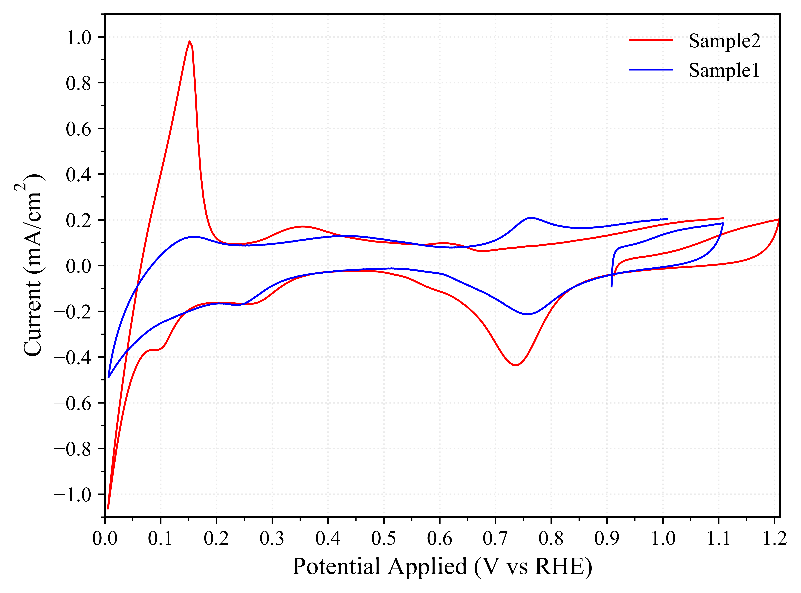
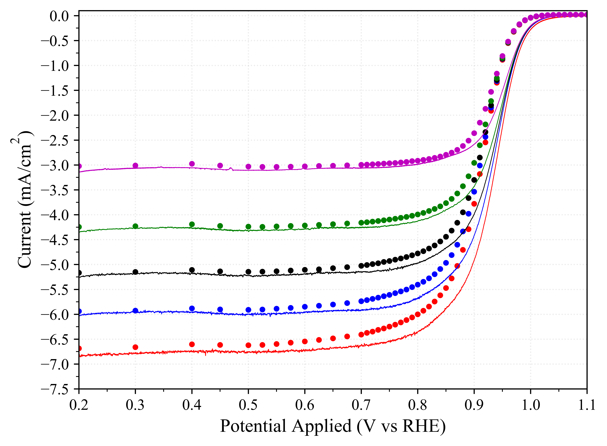
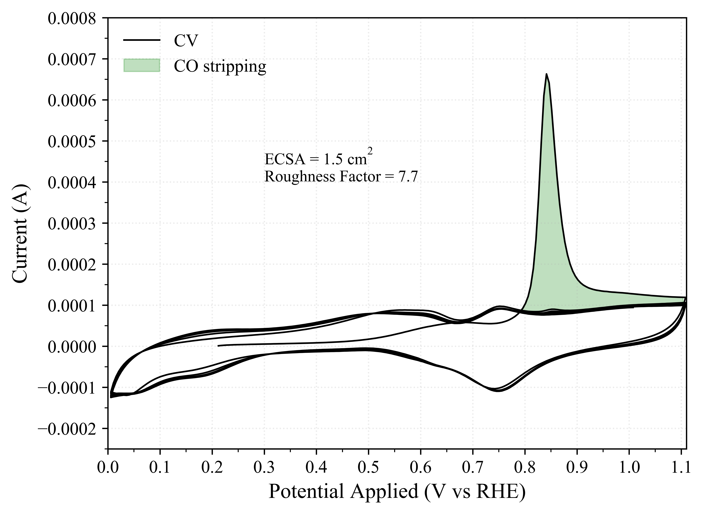

# Description
Data Processing and Plotting for Electrochemical Mesasurements
This tools processes electrochemical data exported using NOVA software. The tool perform the following analyses:
- Cyclic and Linear Sweep Voltomograms
- KL Plot inlcuding reaction number determination
- Tafal Plot
- Electrochemical Surface Area (ECSA) Determination


# To Use
Use the input file in the Example folder as a template for an input file then simply
```bash
$ elechemcat.py input.inp
```
Note: it is recommened to define the location of the elechemcat.py file in the global environmental variables file so the function can be called from any location


# Examples



